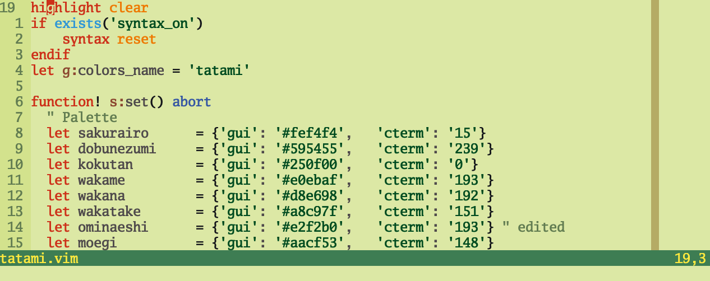

# Configuration files!

Editor based mainly. I'm testing some tweaks after migrating from vimrc to lua.
For the time being I'm playing around changing the tatami colorscheme and
setting up some leaderkey + action combos for fuzzy find / fuzzy snake jump

Font is go monospace (2016)

Preview:

